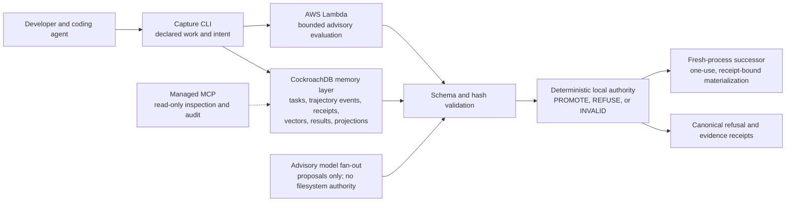

# Gate 8 Architecture and Authority Boundaries R1

## Load-bearing boundaries

- CockroachDB is persistent memory, not verdict authority.
- AWS Lambda and model output are untrusted advisory inputs. Both are
  schema-validated and hash-bound before deterministic evaluation.
- Managed MCP is read-only and cannot mutate memory, recover files, or decide
  pass/fail.
- The deterministic local verifier is the sole promotion/refusal authority.
- Filesystem actions are scoped to declared disposable roots. Absolute paths,
  traversal, unsupported state, tampering, and warrant replay fail closed.
- A successor contains only captured, declared representations that passed the
  frozen policy. Arbitrary uncaptured bytes cannot be recovered from nothing.
